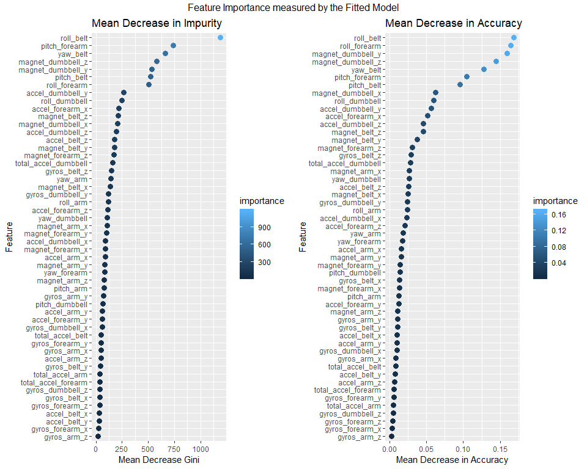
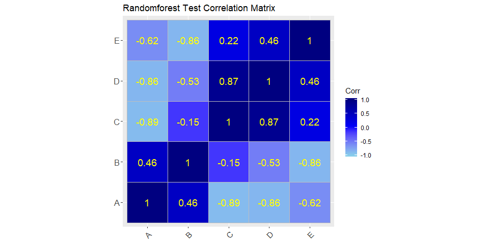

#Executive Summary

The goal of this project, is to use data from accelerometers on the belt, forearm, arm, and dumbell of 6 participants that were asked to perform barbell lifts correctly and incorrectly in 5 different ways to predict the manner in which they did the exercise(This is the "classe" variable in the training set.)

##Background

Using devices such as Jawbone Up, Nike FuelBand, and Fitbit it is now possible to collect a large amount of data about personal activity relatively inexpensively. These type of devices are part of the quantified self movement - a group of enthusiasts who take measurements about themselves regularly to improve their health, to find patterns in their behavior, or because they are tech geeks. One thing that people regularly do is quantify how much of a particular activity they do, but they rarely quantify how well they do it. See Appendix 4.1 for data source details

##Summary of findings

To predict the __classe__ variable, we tried predicting with randomforests. RandomForests method 

1. Bootstrap samples
2. At each split, bootstrap variables
3. Grow multiple trees and vote

Although this method is slow and prone to overfitting, it is has a high accurary rate. 

We fitted 52 feautures as predictors for the ___classe___ variable. The model final model had acuracy of about 98% which we are very comfortable with. Testing the model on our testing samples, the model was able to predict the classe of the barlifts with an accuracy of $\approx 99\% $ and an out-of-sample error of $\approx 99\% $

#Data Processing
##Get Data

```r
#download project data set
if(!file.exists("/data"))
        {
            dir.create("/data");
            download.file("https://d396qusza40orc.cloudfront.net/predmachlearn/pml-training.csv", destfile = "/data/pml-training.csv" )
  download.file("https://d396qusza40orc.cloudfront.net/predmachlearn/pml-testing.csv", destfile = "/data/pml-testing.csv" )
}

#read data sets
training <- read.csv("/data/pml-training.csv",na.strings=c("NA","#DIV/0!",""))

testing<- read.csv("/data/pml-testing.csv",na.strings=c("NA","#DIV/0!",""))
```


##Clean Data

To tidy the data, 

1. We will remove all columns that contains NA and remove features that are not in the testing dataset. The features containing NA are the variance, mean and standard devition (SD) columns. 

2. Since the testing dataset has no time-dependence, these values are useless and can be disregarded. We will also remove the first 7 features since they are related to the time-series or are not numeric.

> see Appendix 4.2, 4.3 for preprocessed and post cleaning data column names


```r
dim(training);dim(testing)
```

```
## [1] 19622   160
```

```
## [1]  20 160
```

```r
##Note that both dataset are having the same variables (160 variables). Next is try remove the near zero variance variables or columns that contain N/A missing values.

features <- names(testing[,colSums(is.na(testing)) == 0])[8:59]

# Only use features used in testing cases.
p_training <- training[,c(features,"classe")]
p_testing <- testing[,c(features,"problem_id")]

dim(p_training); dim(p_testing);
```

```
## [1] 19622    53
```

```
## [1] 20 53
```

```r
# see Appendixs for processed data column names
```
#Analysis and Predictipn

##Data Partitioning
We will partition our data into a training data set (60% of the total cases) and a testing data set (40% of the total cases). This will allow us to estimate the out of sample error of our predictor. 

```r
set.seed(123)

inTrain <- createDataPartition(p_training$classe, p=0.6, list=FALSE)
dp_training <- p_training[inTrain,]
dp_testing <- p_training[-inTrain,]

dim(dp_training); dim(dp_testing);
```

```
## [1] 11776    53
```

```
## [1] 7846   53
```

##Model Fitting

I would be using the random forest prediction model as it is best for __Accuracy__

###Random Forest Model


```r
set.seed(123)

tc <- trainControl(method="cv", 5)
RandomForest <- train(classe ~ ., data=dp_training, method="rf",trControl=tc, ntree=250,importance=TRUE)
RandomForest
```

```
## Random Forest 
## 
## 11776 samples
##    52 predictor
##     5 classes: 'A', 'B', 'C', 'D', 'E' 
## 
## No pre-processing
## Resampling: Cross-Validated (5 fold) 
## Summary of sample sizes: 9421, 9420, 9421, 9420, 9422 
## Resampling results across tuning parameters:
## 
##   mtry  Accuracy   Kappa    
##    2    0.9886203  0.9856024
##   27    0.9889606  0.9860345
##   52    0.9835259  0.9791598
## 
## Accuracy was used to select the optimal model using the largest value.
## The final value used for the model was mtry = 27.
```

```r
#We would test this models accuracy on our test data(dp_training) to get accuracy rate and estimated out-of-sample error

predict_RandomForest <- predict(RandomForest, dp_testing)
confusionMatrix(dp_testing$classe, predict_RandomForest)
```

```
## Confusion Matrix and Statistics
## 
##           Reference
## Prediction    A    B    C    D    E
##          A 2226    6    0    0    0
##          B   11 1503    4    0    0
##          C    0    8 1348   12    0
##          D    0    0   18 1267    1
##          E    0    0    5    4 1433
## 
## Overall Statistics
##                                           
##                Accuracy : 0.9912          
##                  95% CI : (0.9889, 0.9932)
##     No Information Rate : 0.2851          
##     P-Value [Acc > NIR] : < 2.2e-16       
##                                           
##                   Kappa : 0.9889          
##  Mcnemar's Test P-Value : NA              
## 
## Statistics by Class:
## 
##                      Class: A Class: B Class: C Class: D Class: E
## Sensitivity            0.9951   0.9908   0.9804   0.9875   0.9993
## Specificity            0.9989   0.9976   0.9969   0.9971   0.9986
## Pos Pred Value         0.9973   0.9901   0.9854   0.9852   0.9938
## Neg Pred Value         0.9980   0.9978   0.9958   0.9976   0.9998
## Prevalence             0.2851   0.1933   0.1752   0.1635   0.1828
## Detection Rate         0.2837   0.1916   0.1718   0.1615   0.1826
## Detection Prevalence   0.2845   0.1935   0.1744   0.1639   0.1838
## Balanced Accuracy      0.9970   0.9942   0.9886   0.9923   0.9989
```

```r
accuracy <- confusionMatrix(dp_testing$classe, predict_RandomForest)$overall[1]
error<-1 - as.numeric(confusionMatrix(dp_testing$classe, predict_RandomForest)$overall[1])
```
The accuracy of the model is 99.1%  and the estimated out-of-sample error is 0.879%

##Predicting Model on the Test Data

```r
set.seed(123)
pred <- predict(RandomForest,testing)
pred
```

```
##  [1] B A B A A E D B A A B C B A E E A B B B
## Levels: A B C D E
```


#Appendix

##Data Source

The training data for this project are available here:

[https://d396qusza40orc.cloudfront.net/predmachlearn/pml-training.csv](https://d396qusza40orc.cloudfront.net/predmachlearn/pml-training.csv)

The test data are available here:

[https://d396qusza40orc.cloudfront.net/predmachlearn/pml-testing.csv](https://d396qusza40orc.cloudfront.net/predmachlearn/pml-testing.csv)

The data for this project come from this source: http://groupware.les.inf.puc-rio.br/har.

##Preprocessed Data Details

```
##   [1] "X"                        "user_name"               
##   [3] "raw_timestamp_part_1"     "raw_timestamp_part_2"    
##   [5] "cvtd_timestamp"           "new_window"              
##   [7] "num_window"               "roll_belt"               
##   [9] "pitch_belt"               "yaw_belt"                
##  [11] "total_accel_belt"         "kurtosis_roll_belt"      
##  [13] "kurtosis_picth_belt"      "kurtosis_yaw_belt"       
##  [15] "skewness_roll_belt"       "skewness_roll_belt.1"    
##  [17] "skewness_yaw_belt"        "max_roll_belt"           
##  [19] "max_picth_belt"           "max_yaw_belt"            
##  [21] "min_roll_belt"            "min_pitch_belt"          
##  [23] "min_yaw_belt"             "amplitude_roll_belt"     
##  [25] "amplitude_pitch_belt"     "amplitude_yaw_belt"      
##  [27] "var_total_accel_belt"     "avg_roll_belt"           
##  [29] "stddev_roll_belt"         "var_roll_belt"           
##  [31] "avg_pitch_belt"           "stddev_pitch_belt"       
##  [33] "var_pitch_belt"           "avg_yaw_belt"            
##  [35] "stddev_yaw_belt"          "var_yaw_belt"            
##  [37] "gyros_belt_x"             "gyros_belt_y"            
##  [39] "gyros_belt_z"             "accel_belt_x"            
##  [41] "accel_belt_y"             "accel_belt_z"            
##  [43] "magnet_belt_x"            "magnet_belt_y"           
##  [45] "magnet_belt_z"            "roll_arm"                
##  [47] "pitch_arm"                "yaw_arm"                 
##  [49] "total_accel_arm"          "var_accel_arm"           
##  [51] "avg_roll_arm"             "stddev_roll_arm"         
##  [53] "var_roll_arm"             "avg_pitch_arm"           
##  [55] "stddev_pitch_arm"         "var_pitch_arm"           
##  [57] "avg_yaw_arm"              "stddev_yaw_arm"          
##  [59] "var_yaw_arm"              "gyros_arm_x"             
##  [61] "gyros_arm_y"              "gyros_arm_z"             
##  [63] "accel_arm_x"              "accel_arm_y"             
##  [65] "accel_arm_z"              "magnet_arm_x"            
##  [67] "magnet_arm_y"             "magnet_arm_z"            
##  [69] "kurtosis_roll_arm"        "kurtosis_picth_arm"      
##  [71] "kurtosis_yaw_arm"         "skewness_roll_arm"       
##  [73] "skewness_pitch_arm"       "skewness_yaw_arm"        
##  [75] "max_roll_arm"             "max_picth_arm"           
##  [77] "max_yaw_arm"              "min_roll_arm"            
##  [79] "min_pitch_arm"            "min_yaw_arm"             
##  [81] "amplitude_roll_arm"       "amplitude_pitch_arm"     
##  [83] "amplitude_yaw_arm"        "roll_dumbbell"           
##  [85] "pitch_dumbbell"           "yaw_dumbbell"            
##  [87] "kurtosis_roll_dumbbell"   "kurtosis_picth_dumbbell" 
##  [89] "kurtosis_yaw_dumbbell"    "skewness_roll_dumbbell"  
##  [91] "skewness_pitch_dumbbell"  "skewness_yaw_dumbbell"   
##  [93] "max_roll_dumbbell"        "max_picth_dumbbell"      
##  [95] "max_yaw_dumbbell"         "min_roll_dumbbell"       
##  [97] "min_pitch_dumbbell"       "min_yaw_dumbbell"        
##  [99] "amplitude_roll_dumbbell"  "amplitude_pitch_dumbbell"
## [101] "amplitude_yaw_dumbbell"   "total_accel_dumbbell"    
## [103] "var_accel_dumbbell"       "avg_roll_dumbbell"       
## [105] "stddev_roll_dumbbell"     "var_roll_dumbbell"       
## [107] "avg_pitch_dumbbell"       "stddev_pitch_dumbbell"   
## [109] "var_pitch_dumbbell"       "avg_yaw_dumbbell"        
## [111] "stddev_yaw_dumbbell"      "var_yaw_dumbbell"        
## [113] "gyros_dumbbell_x"         "gyros_dumbbell_y"        
## [115] "gyros_dumbbell_z"         "accel_dumbbell_x"        
## [117] "accel_dumbbell_y"         "accel_dumbbell_z"        
## [119] "magnet_dumbbell_x"        "magnet_dumbbell_y"       
## [121] "magnet_dumbbell_z"        "roll_forearm"            
## [123] "pitch_forearm"            "yaw_forearm"             
## [125] "kurtosis_roll_forearm"    "kurtosis_picth_forearm"  
## [127] "kurtosis_yaw_forearm"     "skewness_roll_forearm"   
## [129] "skewness_pitch_forearm"   "skewness_yaw_forearm"    
## [131] "max_roll_forearm"         "max_picth_forearm"       
## [133] "max_yaw_forearm"          "min_roll_forearm"        
## [135] "min_pitch_forearm"        "min_yaw_forearm"         
## [137] "amplitude_roll_forearm"   "amplitude_pitch_forearm" 
## [139] "amplitude_yaw_forearm"    "total_accel_forearm"     
## [141] "var_accel_forearm"        "avg_roll_forearm"        
## [143] "stddev_roll_forearm"      "var_roll_forearm"        
## [145] "avg_pitch_forearm"        "stddev_pitch_forearm"    
## [147] "var_pitch_forearm"        "avg_yaw_forearm"         
## [149] "stddev_yaw_forearm"       "var_yaw_forearm"         
## [151] "gyros_forearm_x"          "gyros_forearm_y"         
## [153] "gyros_forearm_z"          "accel_forearm_x"         
## [155] "accel_forearm_y"          "accel_forearm_z"         
## [157] "magnet_forearm_x"         "magnet_forearm_y"        
## [159] "magnet_forearm_z"         "classe"
```

##Processed Data Details

```
##  [1] "roll_belt"            "pitch_belt"           "yaw_belt"            
##  [4] "total_accel_belt"     "gyros_belt_x"         "gyros_belt_y"        
##  [7] "gyros_belt_z"         "accel_belt_x"         "accel_belt_y"        
## [10] "accel_belt_z"         "magnet_belt_x"        "magnet_belt_y"       
## [13] "magnet_belt_z"        "roll_arm"             "pitch_arm"           
## [16] "yaw_arm"              "total_accel_arm"      "gyros_arm_x"         
## [19] "gyros_arm_y"          "gyros_arm_z"          "accel_arm_x"         
## [22] "accel_arm_y"          "accel_arm_z"          "magnet_arm_x"        
## [25] "magnet_arm_y"         "magnet_arm_z"         "roll_dumbbell"       
## [28] "pitch_dumbbell"       "yaw_dumbbell"         "total_accel_dumbbell"
## [31] "gyros_dumbbell_x"     "gyros_dumbbell_y"     "gyros_dumbbell_z"    
## [34] "accel_dumbbell_x"     "accel_dumbbell_y"     "accel_dumbbell_z"    
## [37] "magnet_dumbbell_x"    "magnet_dumbbell_y"    "magnet_dumbbell_z"   
## [40] "roll_forearm"         "pitch_forearm"        "yaw_forearm"         
## [43] "total_accel_forearm"  "gyros_forearm_x"      "gyros_forearm_y"     
## [46] "gyros_forearm_z"      "accel_forearm_x"      "accel_forearm_y"     
## [49] "accel_forearm_z"      "magnet_forearm_x"     "magnet_forearm_y"    
## [52] "magnet_forearm_z"     "classe"
```

##Variable Importance Plots
<!-- -->

##Model correlation matrix 
A plot of our prediction on our test data:dp_testing
<!-- -->

